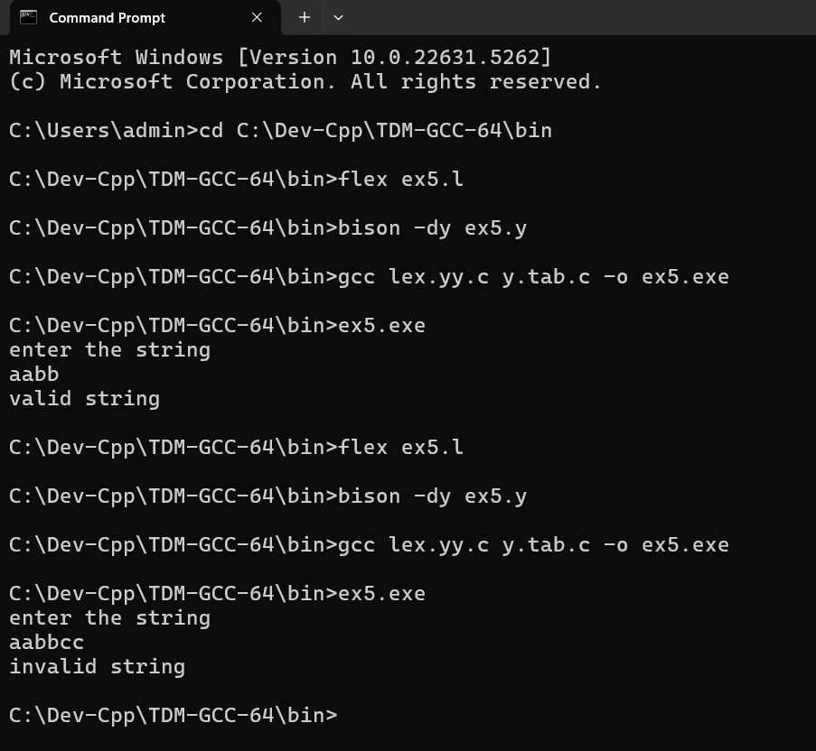

# Ex-5-RECOGNITION-OF-THE-GRAMMAR-anb-where-n-10-USING-YACC
RECOGNITION OF THE GRAMMAR(anb where n>=10) USING YACC
# Date: 7/5/2025
# Aim:
To write a YACC program to recognize the grammar anb where n>=10.
# ALGORITHM
1.	Start the program.
2.	Write a program in the vi editor and save it with .l extension.
3.	In the lex program, write the translation rules for the variables a and b.
4.	Write a program in the vi editor and save it with .y extension.
5.	Compile the lex program with lex compiler to produce output file as lex.yy.c. eg $ lex filename.l
6.	Compile the yacc program with yacc compiler to produce output file as y.tab.c. eg $ yacc –d arith_id.y
7.	Compile these with the C compiler as gcc lex.yy.c y.tab.c
8.	Enter a string as input and it is identified as valid or invalid.
# PROGRAM:

## ex5.l file

```
%{
#include "y.tab.h"
%}

/* Rule Section */
%%
[aA]       { return A; }
[bB]       { return B; }
\n         { return NL; }
.          { return yytext[0]; }
%%

int yywrap() {
    return 1;
}
```

## ex5.y file 

```
%{
#include <stdio.h>
#include <stdlib.h>

// Declare yylex and yyerror explicitly
int yylex(void);
int yyerror(char *msg);
%}

%token A B NL

%%
stmt: S NL { printf("valid string\n"); exit(0); }
    ;

S: A S B
 | /* empty */
 ;
%%

int yyerror(char *msg) {
    printf("invalid string\n");
    exit(0);
    return 0;
}

int main() {
    printf("enter the string\n");
    yyparse();
    return 0;
}
```

# OUTPUT


# RESULT
The YACC program to recognize the grammar anb where n>=10 is executed successfully and the output is verified.
